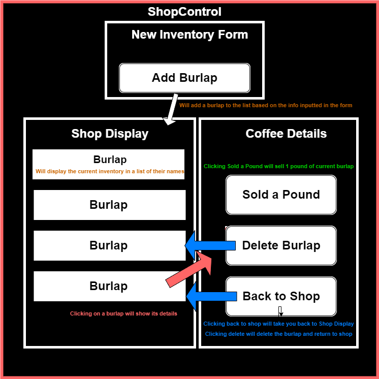

# Coffee Shop Inventory Tracker
#### By Trent Dietzel

## Table of Contents
- [About](#about)
- [Demo](#demo)
- [Technologies Used](#technologies-used)
- [Features](#features)
- [Installation](#installation)
- [Usage](#usage)
- [Contributing](#contributing)
- [Known Bugs](#known-bugs)
- [License](#license)
- [Contact](#contact)

## About
The primary functionality of the application is to manage a coffee shop's inventory. Users can add new coffee products, view details, make purchases, and delete items from the inventory.

## Diagram

## Demo
You can try out the live demo of the Coffee Shop Inventory Tracker [here](https://tdietzel.github.io/Coffee_Shop_Redux/).

## Technologies Used
- HTML
- CSS (Bootstrap for styling)
- JavaScript
- NPM (Node Package Manager): for package management
- Lint: for code quality and style checking
- Vite: Build tool for modern web development
- Vitest: for testing the JavaScript code
- React.js: JavaScript library for building user interfaces
- Redux: State management library
- @reduxjs/toolkit: Redux toolkit for efficient Redux development
- React Redux: Official React bindings for Redux
- uuid: Library for generating unique identifiers

## Features
- **Add New Inventory**: Users can add new coffee products to the inventory.
- **Edit Inventory**: Users can edit the current inventory items incase of mistakes.
- **View Coffee Details**: Detailed information about each coffee product is available.
- **Make Purchases**: Users can simulate selling a pound of coffee, reducing the quantity in the inventory.
- **Delete Inventory Items**: Unwanted inventory items can be removed from the system.

## Installation

Follow these steps to set up the project locally:
1. Open Git BASH [Download Link](https://gitforwindows.org/)
2. Clone the repository to your local machine:
   ```bash
   git clone https://github.com/tdietzel/Coffee_Shop_Redux
   ```
3. Open the project directory:
   ```bash
   cd Coffee_Shop_Redux
   ```
4. Open in a code editor like __Visual Studio Code__.
5. Open the VS Code terminal and enter this command to install needed dependencies:
   ```bash
   npm install
   ```
6. The run once installed to view in browser or to use for further development:
   ```bash
   npm run dev
   ```

## Usage
To use Coffee Shop Inventory Tracker:

1. Visit the website [Here](https://tdietzel.github.io/Coffee_Shop_Redux/).
2. Explore the coffee shop inventory.
3. Add new inventory items using the form provided.
4. View detailed information about each coffee product.
5. Simulate selling a pound of coffee using the "Sold a Pound" button.
6. Remove unwanted inventory items with the "Delete Burlap" button.

## Contributing

I welcome contributions to improve the project. If you'd like to contribute, please follow these guidelines:
1. Fork the project repository.
2. Create a new branch for your feature or bug fix.
3. Make your changes and test thoroughly.
4. Commit your changes with a descriptive commit message.
5. Push your branch to your forked repository.
6. Create a pull request to the main repository.

## Known Bugs

* _N/A_

## License
This project is licensed under the MIT License. See the LICENSE file for details.

## Contact
For any questions, suggestions, or inquiries, please contact **Trent Dietzel** at _dietzelbiz@outlook.com_.
